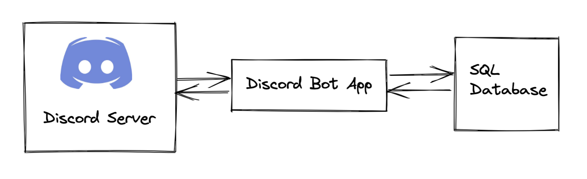

# Technical Spec

## What technical details do developers need to know to develop the software or new feature?

- Discord API
- Google Sheets API
- SQL databases (optionally, distributed)
- Python
- OOP
- Deploying an API in the cloud (optional)

## Are there new tables to add to the database? What fields?

- tournament
  - id (from discord)
  - sheet_id (google)
- player
  - id (unique)
  - tournament id
  - name
  - row
  - team id
  - auction_team id
- team
  - id (unique)
  - tournament id
  - name
  - abbrev
- match
  - id (unique)
  - tournament id
  - home_team id
  - home_team match_num
  - away_team id
  - away_team match_num
  - start_time
- kaptaan
  - id (unique)
  - match id
  - player id
- auction_team
  - id (unique, role from discord)
  - tournament id
- trade
  - id
  - in_player id
  - out_player id
  - timestamp
  - hit
  - window id
  - in_auction_team id
  - out_auction_team id
  - confirmed
- window
  - id (unique)
  - tournament id
  - start_time
  - end_time
- window_transfer
  - window_id
  - auction_team id
  - order
  - start_time
  - end_time
  - completed
- rolled_transfer
  - auction_team id
  - rolled_time
  - completed

## System design

### High Level System Design

### Detailed System Design

TODO detailed system design

## Which classes are needed?

TODO classes needed

## Commands

### Transfer/Trade Related

- `transfer [in] for [out] [hit]`: transfer a player in for out with a hit

### Kaptaan

### General Utility

- `help`: show all the commands that can run

- `rolltransfer`: rolls a transfer
- `whosetransferisit`: shows whose transfer it is
- `kaptaan [player]`: set kaptaan to player (limit next day)
- `startwindow`: start the transfer window for a particular gameweek (admins only)
- `proposetrade [in] for [out]`: proposes a trade between two auction_teams
- `confirmtrade [id]`: confirms a trade (the other party must confirm)
- `sheetlink`: returns a link to the sheet

## What third-party software is needed to build the software or feature?

- Discord API
- Google Sheets API

## General Tips

- Can use UML for designing classes
- Using SOLID principles
